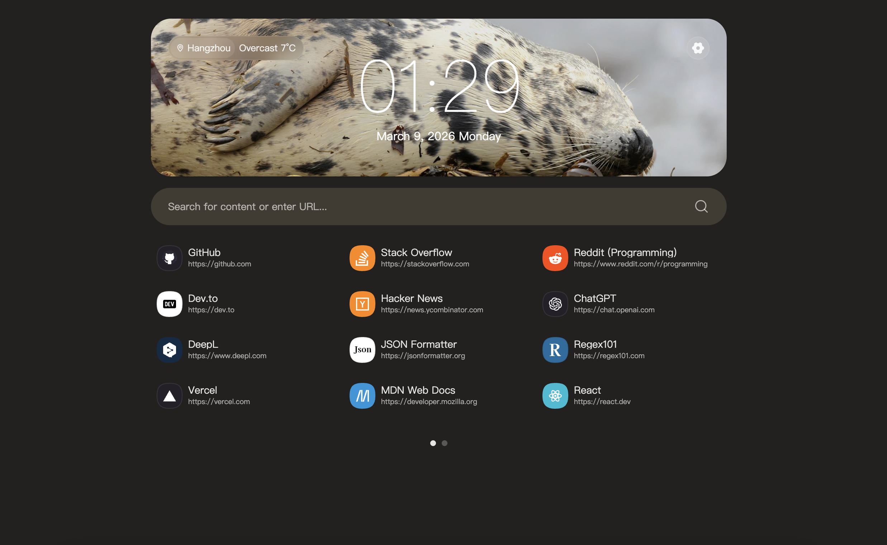
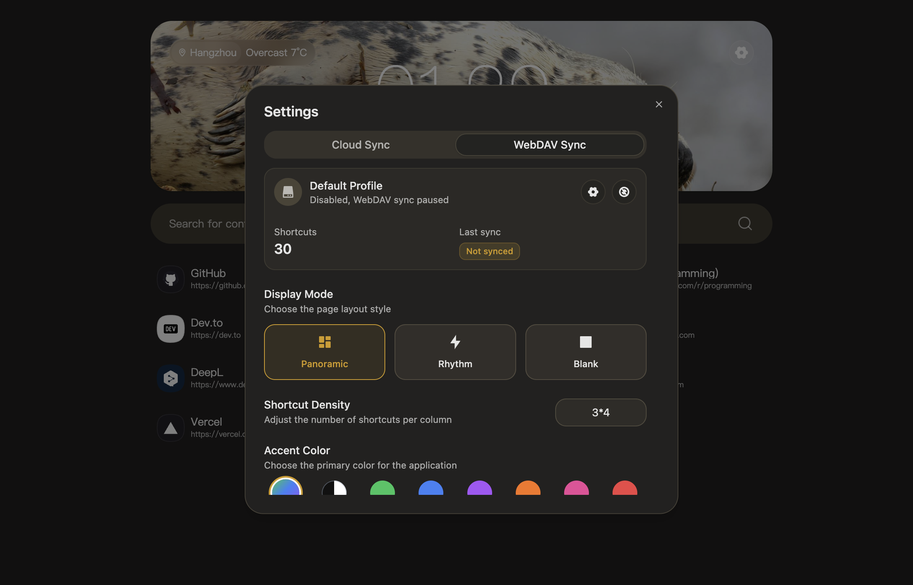

<div align="center">
  <h1 style="border-bottom: none">
    LeafTab
    <br />
  </h1>
  <p>
    Minimal · Clean · Distraction-Free
  </p>
  <p>
    <a href="https://github.com/mason173/LeafTab/releases">下载 Release</a>
    ·
    <a href="https://chromewebstore.google.com/detail/leaftab/lfogogokkkpmolbfbklchcbgdiboccdf?hl=zh-CN&gl=DE">Chrome 商店</a>
    ·
    <a href="https://microsoftedge.microsoft.com/addons/detail/leaftab/nfbdmggppgfmfbaddobdhdleppgffphn">Edge 商店</a>
    ·
    <a href="https://github.com/mason173/LeafTab/issues">问题反馈</a>
    ·
    <a href="https://github.com/mason173/LeafTab/discussions">讨论</a>
  </p>
  <p>
    <a href="https://github.com/mason173/LeafTab/releases">
      
    </a>
  </p>
  <p>
    <a href="https://github.com/mason173/LeafTab/releases">
      
    </a>
    <a href="https://github.com/mason173/LeafTab/blob/main/LICENSE">
      
    </a>
    <a href="https://github.com/mason173/LeafTab/stargazers">
      
    </a>
  </p>
</div>

LeafTab 是一款浏览器新标签页扩展，提供简洁美观的起始页体验，支持快捷方式管理、壁纸/天气展示，以及云同步与 WebDAV 同步等能力。

## 功能亮点

- 快捷方式管理与多布局模式
- 壁纸与天气组件
- 登录同步（后端可自托管）
- WebDAV 同步
- 管理员模式：导出缺失图标域名清单

## 预览

<div align="center">
  
  <br />
  <br />
  
</div>

## 安装

从 [Releases](https://github.com/mason173/LeafTab/releases) 下载对应压缩包：

- Chrome / Edge：下载 `LeafTab-chrome-edge-*.zip`，解压后在扩展管理页开启开发者模式，选择“加载已解压的扩展程序”，选择解压后的 `build/` 目录。
- Firefox：下载 `LeafTab-firefox-*.zip`，解压后在 `about:debugging` → “This Firefox” → “Load Temporary Add-on…” 中选择解压目录里的 `manifest.json`。

## 项目结构

- `src/`：前端（扩展新标签页）
- `public/`：扩展静态资源与 `manifest.json`
- `server/`：后端（登录/同步/统计/管理员导出）
- `deployment/`：部署示例（Caddy/systemd/env 示例）

## 本地开发（前端）

```bash
npm i
npm run dev
```

## 构建（前端）

```bash
npm run build
```

## 本地运行（后端）

```bash
cd server
npm i
JWT_SECRET=change-me SESSION_SECRET=change-me ADMIN_API_KEY=change-me node index.js
```

## 管理员导出（自托管运营者）

说明：域名清单用于“图标助手”统计缺失图标的域名，不包含完整 URL。导出需要管理员密钥（`ADMIN_API_KEY`）。

- 进入管理员模式：设置底部版本号连点 6 次
- 在设置里填写管理员密钥：与服务器环境变量 `ADMIN_API_KEY` 一致
- 使用管理员面板下载导出

## 安全说明

- 生产环境必须设置 `JWT_SECRET` / `SESSION_SECRET` / `ADMIN_API_KEY`
- 不要将 `.env`、数据库文件或私钥提交到仓库
