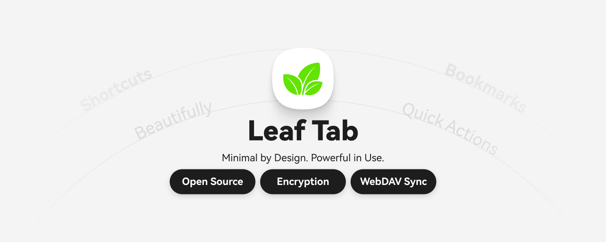

<div align="center">
  <h1 style="border-bottom: none">
    LeafTab
    <br />
  </h1>
  <p>
    Minimal by Design. Powerful in Use.
    <br />
    设计极简，使用强大
  </p>
  <p>
    <a href="https://github.com/mason173/LeafTab/releases">下载 Release / Download</a>
    ·
    <a href="https://chromewebstore.google.com/detail/leaftab/lfogogokkkpmolbfbklchcbgdiboccdf?hl=zh-CN&gl=DE">Chrome 商店 / Store</a>
    ·
    <a href="https://microsoftedge.microsoft.com/addons/detail/leaftab/nfbdmggppgfmfbaddobdhdleppgffphn">Edge 商店 / Store</a>
    ·
    <a href="https://addons.mozilla.org/zh-CN/firefox/addon/leaftab/">Firefox 商店 / Store</a>
    ·
    <a href="https://github.com/mason173/LeafTab/issues">问题反馈 / Issues</a>
    ·
    <a href="https://github.com/mason173/LeafTab/discussions">讨论 / Discussions</a>
  </p>
  <p>
    <a href="https://github.com/mason173/LeafTab/releases">
      
    </a>
  </p>
  <p>
    
  </p>
  <p>
    <a href="https://github.com/mason173/LeafTab/releases">
      
    </a>
    <a href="https://github.com/mason173/LeafTab/blob/main/LICENSE">
      
    </a>
    <a href="https://github.com/mason173/LeafTab/stargazers">
      
    </a>
  </p>
</div>

LeafTab，一个极简但不简单的新标签页插件。它不试图成为臃肿的浏览器操作系统，而是把“打开新标签页”重新打磨成一个高效起点: 干净的界面、顺手的快捷方式，以及一套支持快捷键、标签页、书签、历史记录、搜索引擎切换的强大搜索体验。它不追求花哨，而是追求稳定、顺手、可控。

LeafTab is a minimalist but capable new-tab extension. Instead of turning the browser into a bloated operating system, it refines the act of opening a new tab into an efficient starting point: a clean interface, fast shortcuts, and a powerful keyboard-first search experience across tabs, bookmarks, history, and multiple search engines. It does not chase flashy effects; it focuses on stability, smoothness, and control.

## 社区交流 / Community

- 交流 QQ 群：`1075260794`

## 功能亮点 / Features

- **强大的快捷键搜索系统 / Powerful keyboard-first search**
- **标签页 / 书签 / 历史记录 / 搜索引擎一体化搜索 / Unified search across tabs, bookmarks, history, and search engines**
- **快捷方式管理与多布局模式 / Shortcut management with multiple layout modes**
- **壁纸与天气组件 / Wallpaper and weather widgets**
- **登录同步（后端可自托管）/ Cloud sync (Self-hostable backend)**
- **WebDAV 同步 / WebDAV sync support**
- **管理员模式：域名后台管理页（搜索/排序/分页/复制/CSV），支持自托管服务器 / Admin mode: Domains admin board (search/sort/paging/copy/CSV), supports self-hosted backend**
- **自定义后端地址（登录/同步/统计）/ Custom backend URL (Auth/Sync/Stats)**

## 隐私与数据说明 / Privacy & Data Handling

- 本地存储 / Stored locally:
  快捷方式数据、场景模式、UI 偏好、同步状态标记等配置。  
  Shortcuts, scenario modes, UI preferences, and sync state flags.
- 云端存储（仅登录后）/ Stored in cloud (only when logged in):
  你的快捷方式备份数据与必要账号信息。  
  Your shortcut backup payload and required account metadata.
- WebDAV 存储（可选）/ WebDAV storage (optional):
  仅在用户开启 WebDAV 后，将备份写入你指定的 WebDAV 路径。  
  Backup is written only when WebDAV sync is enabled by the user.
- WebDAV 域名权限（按需申请）/ WebDAV host permission (requested on demand):
  仅在用户配置并触发 WebDAV 同步时，才会对该目标域名请求扩展权限（支持 HTTP/HTTPS）。  
  Extension host permission is requested only for the configured WebDAV domain when the user triggers WebDAV sync (HTTP/HTTPS supported).
- 不上传本地敏感文件 / No upload of local sensitive files:
  LeafTab 不会扫描或上传你设备中的任意本地文件。  
  LeafTab does not scan or upload arbitrary local files from your device.
- 数据可控 / Data controllable:
  可导出、可导入、可切换本地/云端策略、可自托管后端。  
  Export/import supported, local-vs-cloud strategy selectable, self-hosting supported.

## 预览 / Preview

<div align="center">
  
  <br />
  <br />
  
  <br />
  <br />
  
  <br />
  <br />
  
</div>

## 安装 / Installation

从 [Releases](https://github.com/mason173/LeafTab/releases) 下载对应压缩包：
Download the corresponding package from [Releases](https://github.com/mason173/LeafTab/releases):

- **Chrome / Edge**：下载 `LeafTab-community-chrome-edge-v*.zip` 或 `LeafTab-store-chrome-edge-v*.zip`，解压后在扩展管理页开启开发者模式，选择“加载已解压的扩展程序”，选择解压后的根目录（目录内应直接包含 `manifest.json`）。
  Download `LeafTab-community-chrome-edge-v*.zip` or `LeafTab-store-chrome-edge-v*.zip`, extract it, enable "Developer mode" in the extension management page, click "Load unpacked", and select the extracted root folder (it should directly contain `manifest.json`).
- **Firefox**：下载 `LeafTab-community-firefox-v*.zip` 或 `LeafTab-store-firefox-v*.zip`，解压后在 `about:debugging` → “This Firefox” → “Load Temporary Add-on…” 中选择解压根目录里的 `manifest.json`。
  Download `LeafTab-community-firefox-v*.zip` or `LeafTab-store-firefox-v*.zip`, extract it, go to `about:debugging` -> "This Firefox" -> "Load Temporary Add-on..." and select the `manifest.json` in the extracted root directory.

## 项目结构 / Project Structure

- `src/`：前端（扩展新标签页）/ Frontend (Extension page)
- `public/`：扩展静态资源与 `manifest.json` / Static assets and manifest.json
- `public/leaftab-icons/`：官方图标库源目录（`shapes/`）与自动生成的 `icon-library.json` / Canonical official icon library source (`shapes/`) and generated `icon-library.json`
- `server/`：后端（登录/同步/统计/管理员能力）/ Backend (Auth/Sync/Stats/Admin capabilities)
  - `server/routes/`：按领域拆分的接口路由 / Route modules by domain
  - `server/lib/`：环境、鉴权、限流、数据库初始化等基础模块 / Shared infra modules (env/auth/rate-limit/db init)
- `deployment/`：部署示例 / Deployment examples (Caddy/systemd/env)

## 本地开发（前端）/ Local Development (Frontend)

```bash
npm i
npm run dev
```

`public/leaftab-icons/shapes/` 是主仓库内维护的新版图标源目录，会随主仓库一起管理。图标文件名必须使用 `domain_HEX.svg` 格式，例如 `www.wps.cn_FE3E53.svg`。`npm run dev`、`npm run build` 和 `npm run icons:sync` 都会自动根据这些文件重建 `public/leaftab-icons/icon-library.json`。
`public/leaftab-icons/shapes/` is the canonical icon source directory maintained inside this repository and versioned together with the main project. Icon file names must follow the `domain_HEX.svg` format, for example `www.wps.cn_FE3E53.svg`. `npm run dev`, `npm run build`, and `npm run icons:sync` all rebuild `public/leaftab-icons/icon-library.json` from those files automatically.

## 构建（前端）/ Build (Frontend)

```bash
npm run build
```

Firefox 校验 / Firefox validation:

```bash
# community 包：构建 Chrome/Firefox 产物并跑 web-ext lint
npm run verify:firefox:community

# store 包：构建 Chrome/Firefox 产物并跑 web-ext lint
npm run verify:firefox:store
```

## 本地运行（后端）/ Local Run (Backend)

```bash
cd server
npm i
JWT_SECRET=change-me SESSION_SECRET=change-me ADMIN_API_KEY=change-me node index.js
```

## 自托管后端（用于登录同步/管理员面板）/ Self-Hosted Backend (Auth/Sync/Admin)

后端服务在 `server/` 目录，可独立部署到你的服务器上。前端支持在管理员模式里配置“自定义后端地址”，用于登录/同步/统计等请求转发到你自己的后端。
The backend lives in `server/` and can be deployed independently. In admin mode, you can set a "Custom Backend URL" so auth/sync/stats requests go to your own server.

快速开始（本地）/ Quick start (local):

```bash
cd server
npm i
JWT_SECRET=change-me SESSION_SECRET=change-me ADMIN_API_KEY=change-me node index.js
```

前端配置 / Frontend configuration:

- 进入管理员模式：设置底部版本号连点 6 次 / Tap settings version 6 times to enter admin mode
- 在管理员面板填写“自定义后端地址”（例如 `http://localhost:3001` 或 `https://your-domain.com`）
- 如需使用管理员面板：同时填写管理员密钥（与后端 `ADMIN_API_KEY` 保持一致）

部署参考 / Deployment references:

- 示例文件：`deployment/`（Caddy/systemd/env）
- HTTPS 指南：`docs/HTTPS_GUIDE.md`
- 一键部署脚本：`scripts/deploy.sh`（交互输入服务器地址；密码由 SSH/SCP 原生提示）

部署脚本示例 / Deploy script examples:

```bash
# 交互模式（会提示输入服务器地址）
bash scripts/deploy.sh

# 自定义你的线上域名（自托管强烈建议显式传入）
LEAFTAB_PUBLIC_ORIGIN=https://your-domain.com bash scripts/deploy.sh

# 自定义后端部署目录
LEAFTAB_BACKEND_REMOTE_DIR=/root/browser-start-page-server bash scripts/deploy.sh
```

## 管理员域名后台 / Admin Domains Board

说明：域名后台用于“图标助手”统计缺失图标域名。访问需要管理员密钥（`ADMIN_API_KEY`）。
Note: The domains admin board is used by "Icon Assistant" to track missing icon domains. Access requires an admin key (`ADMIN_API_KEY`).

- 进入管理员模式：设置底部版本号连点 6 次 / Enter admin mode: Tap the version number 6 times in settings.
- 在设置里填写管理员密钥 / Fill in the admin key in settings.
- 在管理员面板点击“打开管理页” / Click "Open Admin Page" in admin panel.
- `Count/Users` 语义：同一域名的**唯一用户数**（同一用户重复上报不会累计） / `Count/Users` means unique users per domain.
- 管理页支持“隐藏已适配域名”，会结合本地 `public/leaftab-icons/icon-library.json` 做主域匹配（如 `index.baidu.com` 视为 `baidu.com` 同品牌） / Supports hiding already-supported domains via the local `public/leaftab-icons/icon-library.json` with registrable-domain matching.

## 维护脚本 / Maintenance Scripts

```bash
# 清空域名统计历史（保留用户账号数据）
cd server
npm run clear:domain-stats
```

## 安全说明 / Security

- 生产环境必须设置 `JWT_SECRET` / `SESSION_SECRET` / `ADMIN_API_KEY`
- 不要将 `.env`、数据库文件或私钥提交到仓库
- Always set secrets in production; do not commit sensitive files to the repository.

## 许可证 / License

LeafTab Community Edition 使用 GNU General Public License v3.0 或更高版本（`GPL-3.0-or-later`）发布。  
LeafTab Community Edition is released under GNU General Public License v3.0 or later (`GPL-3.0-or-later`).

完整许可证文本见 [LICENSE](./LICENSE)。  
See [LICENSE](./LICENSE) for the full license text.

## ✨ Star 数 / Star History

[](https://star-history.com/#mason173/LeafTab&Date)
