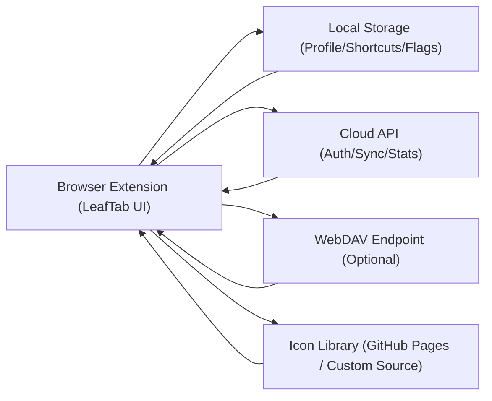

<div align="center">
  <h1 style="border-bottom: none">
    LeafTab
    <br />
  </h1>
  <p>
    Minimal · Clean · Distraction-Free
    <br />
    极简 · 纯净 · 无干扰
  </p>
  <p>
    <a href="https://github.com/mason173/LeafTab/releases">下载 Release / Download</a>
    ·
    <a href="https://chromewebstore.google.com/detail/leaftab/lfogogokkkpmolbfbklchcbgdiboccdf?hl=zh-CN&gl=DE">Chrome 商店 / Store</a>
    ·
    <a href="https://microsoftedge.microsoft.com/addons/detail/leaftab/nfbdmggppgfmfbaddobdhdleppgffphn">Edge 商店 / Store</a>
    ·
    <a href="https://addons.mozilla.org/zh-CN/firefox/addon/leaftab/">Firefox 商店 / Store</a>
    ·
    <a href="https://github.com/mason173/LeafTab/issues">问题反馈 / Issues</a>
    ·
    <a href="https://github.com/mason173/LeafTab/discussions">讨论 / Discussions</a>
  </p>
  <p>
    <a href="https://github.com/mason173/LeafTab/releases">
      
    </a>
  </p>
  <p>
    <a href="https://github.com/mason173/LeafTab/releases">
      
    </a>
    <a href="https://github.com/mason173/LeafTab/blob/main/LICENSE">
      
    </a>
    <a href="https://github.com/mason173/LeafTab/stargazers">
      
    </a>
  </p>
</div>

LeafTab 是一款纯VibeCoding编写的浏览器新标签页扩展，主要使用的AI模型是Chatgpt 5.2与Gemini 3 ，提供简洁美观的起始页体验，支持快捷方式管理、壁纸/天气展示，以及云同步与 WebDAV 同步等能力。

LeafTab is a browser new-tab extension built entirely via Vibe Coding, mainly using ChatGPT 5.2 and Gemini 3. It provides a clean and beautiful start-page experience with shortcut management, wallpaper/weather widgets, and cloud sync plus WebDAV sync.

## 功能亮点 / Features

- **快捷方式管理与多布局模式 / Shortcut management with multiple layout modes**
- **壁纸与天气组件 / Wallpaper and weather widgets**
- **登录同步（后端可自托管）/ Cloud sync (Self-hostable backend)**
- **WebDAV 同步 / WebDAV sync support**
- **管理员模式：导出缺失图标域名清单，支持自托管服务器 / Admin mode: Export missing icon domain list, supports self-hosted backend**
- **自定义后端地址（登录/同步/统计）/ Custom backend URL (Auth/Sync/Stats)**

## 为什么选 LeafTab / Why LeafTab

| 维度 / Dimension | LeafTab | 常见新标签页扩展 / Typical New-tab Extensions |
| --- | --- | --- |
| 数据主权 / Data ownership | 支持本地优先 + 云同步 + WebDAV + 自托管后端 / Local-first + Cloud sync + WebDAV + Self-hosted backend | 多数仅依赖单一云端，迁移成本高 / Usually a single cloud backend |
| 冲突处理 / Sync conflict handling | 登录时显式冲突选择（本地/云端） / Explicit conflict choice on login (Local/Cloud) | 常见静默覆盖，数据来源不透明 / Often silent overwrite |
| 同步稳定性 / Sync stability | 定时对齐同步、限流兜底、本地持久化 / Scheduled aligned sync, rate-limit fallback, local persistence | 失败后行为不可预期 / Retry behavior often unclear |
| 可运维性 / Operability | 管理员模式、域名导出、可替换图标源 / Admin mode, domain export, custom icon source | 运维可观测能力弱 / Limited observability |
| 视觉体验 / Visual experience | 动态壁纸、天气视频、动态取色 / Dynamic wallpaper, weather video, dynamic accent | UI 能力相对固定 / More static UI |

## 架构与数据流 / Architecture & Data Flow



- 核心原则 / Core principle: **本地优先渲染，云端与 WebDAV 作为同步层**  
- 登录同步 / Cloud sync: 登录时做本地/云端差异比对，避免静默覆盖  
- 定时同步 / Scheduled sync: 基于系统时间对齐触发，支持限流和重试兜底  
- 可替换能力 / Pluggable services: 后端地址与图标源均可自定义  

## 隐私与数据说明 / Privacy & Data Handling

- 本地存储 / Stored locally:
  快捷方式数据、场景模式、UI 偏好、同步状态标记等配置。  
  Shortcuts, scenario modes, UI preferences, and sync state flags.
- 云端存储（仅登录后）/ Stored in cloud (only when logged in):
  你的快捷方式备份数据与必要账号信息。  
  Your shortcut backup payload and required account metadata.
- WebDAV 存储（可选）/ WebDAV storage (optional):
  仅在用户开启 WebDAV 后，将备份写入你指定的 WebDAV 路径。  
  Backup is written only when WebDAV sync is enabled by the user.
- 不上传本地敏感文件 / No upload of local sensitive files:
  LeafTab 不会扫描或上传你设备中的任意本地文件。  
  LeafTab does not scan or upload arbitrary local files from your device.
- 数据可控 / Data controllable:
  可导出、可导入、可切换本地/云端策略、可自托管后端。  
  Export/import supported, local-vs-cloud strategy selectable, self-hosting supported.

## 预览 / Preview

<div align="center">
  
  <br />
  <br />
  
  <br />
  <br />
  
</div>

## 安装 / Installation

从 [Releases](https://github.com/mason173/LeafTab/releases) 下载对应压缩包：
Download the corresponding package from [Releases](https://github.com/mason173/LeafTab/releases):

- **Chrome / Edge**：下载 `LeafTab-chrome-edge-*.zip`，解压后在扩展管理页开启开发者模式，选择“加载已解压的扩展程序”，选择解压后的 `build/` 目录。
  Download `LeafTab-chrome-edge-*.zip`, extract it, enable "Developer mode" in the extension management page, click "Load unpacked", and select the `build/` directory.
- **Firefox**：下载 `LeafTab-firefox-*.zip`，解压后在 `about:debugging` → “This Firefox” → “Load Temporary Add-on…” 中选择解压目录里的 `manifest.json`。
  Download `LeafTab-firefox-*.zip`, extract it, go to `about:debugging` -> "This Firefox" -> "Load Temporary Add-on..." and select the `manifest.json` file.

## 项目结构 / Project Structure

- `src/`：前端（扩展新标签页）/ Frontend (Extension page)
- `public/`：扩展静态资源与 `manifest.json` / Static assets and manifest.json
- `server/`：后端（登录/同步/统计/管理员导出）/ Backend (Auth/Sync/Stats/Admin export)
- `deployment/`：部署示例 / Deployment examples (Caddy/systemd/env)

## 本地开发（前端）/ Local Development (Frontend)

```bash
npm i
npm run dev
```

## 构建（前端）/ Build (Frontend)

```bash
npm run build
```

## 本地运行（后端）/ Local Run (Backend)

```bash
cd server
npm i
JWT_SECRET=change-me SESSION_SECRET=change-me ADMIN_API_KEY=change-me node index.js
```

## 自托管后端（用于登录同步/管理员导出）/ Self-Hosted Backend (Auth/Sync/Admin)

后端服务在 `server/` 目录，可独立部署到你的服务器上。前端支持在管理员模式里配置“自定义后端地址”，用于登录/同步/统计等请求转发到你自己的后端。
The backend lives in `server/` and can be deployed independently. In admin mode, you can set a "Custom Backend URL" so auth/sync/stats requests go to your own server.

快速开始（本地）/ Quick start (local):

```bash
cd server
npm i
JWT_SECRET=change-me SESSION_SECRET=change-me ADMIN_API_KEY=change-me node index.js
```

前端配置 / Frontend configuration:

- 进入管理员模式：设置底部版本号连点 6 次 / Tap settings version 6 times to enter admin mode
- 在管理员面板填写“自定义后端地址”（例如 `http://localhost:3001` 或 `https://your-domain.com`）
- 如需管理员导出：同时填写管理员密钥（与后端 `ADMIN_API_KEY` 保持一致）

部署参考 / Deployment references:

- 示例文件：`deployment/`（Caddy/systemd/env）
- HTTPS 指南：`docs/HTTPS_GUIDE.md`

## 管理员导出 / Admin Export

说明：域名清单用于“图标助手”统计缺失图标的域名。导出需要管理员密钥（`ADMIN_API_KEY`）。
Note: Domain list is used for "Icon Assistant" stats. Exporting requires an admin key (`ADMIN_API_KEY`).

- 进入管理员模式：设置底部版本号连点 6 次 / Enter admin mode: Tap the version number 6 times in settings.
- 在设置里填写管理员密钥 / Fill in the admin key in settings.
- 使用管理员面板下载导出 / Use the admin panel to download the export.

## 安全说明 / Security

- 生产环境必须设置 `JWT_SECRET` / `SESSION_SECRET` / `ADMIN_API_KEY`
- 不要将 `.env`、数据库文件或私钥提交到仓库
- Always set secrets in production; do not commit sensitive files to the repository.

## ✨ Star 数 / Star History

[](https://star-history.com/#mason173/LeafTab&Date)
